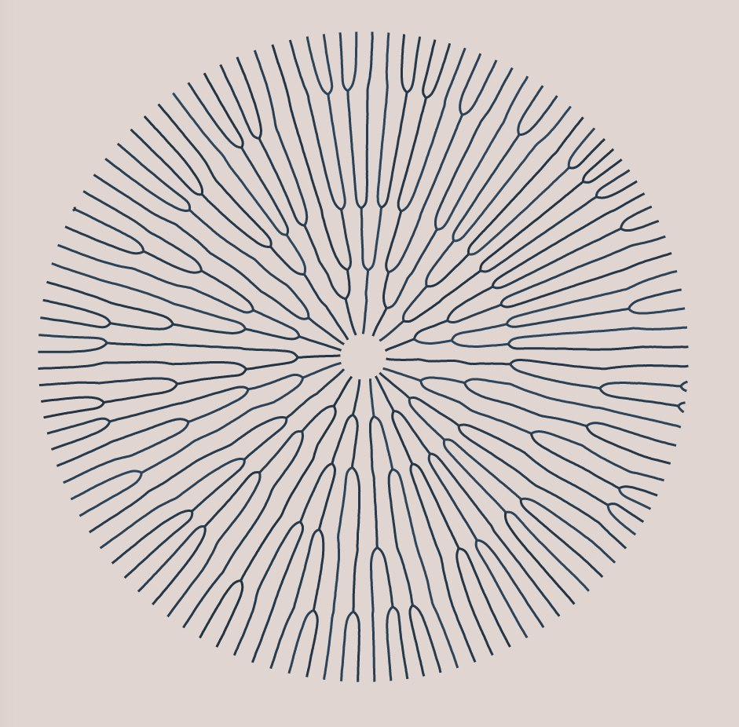
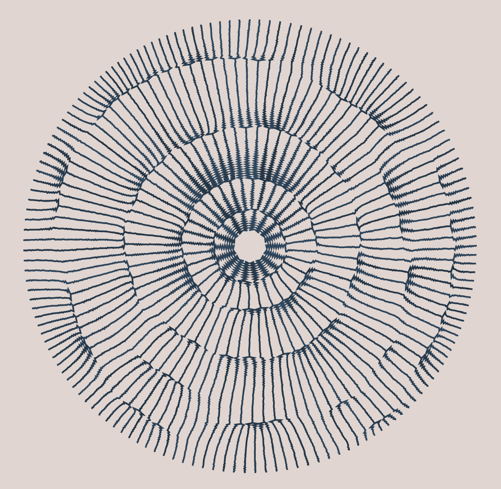
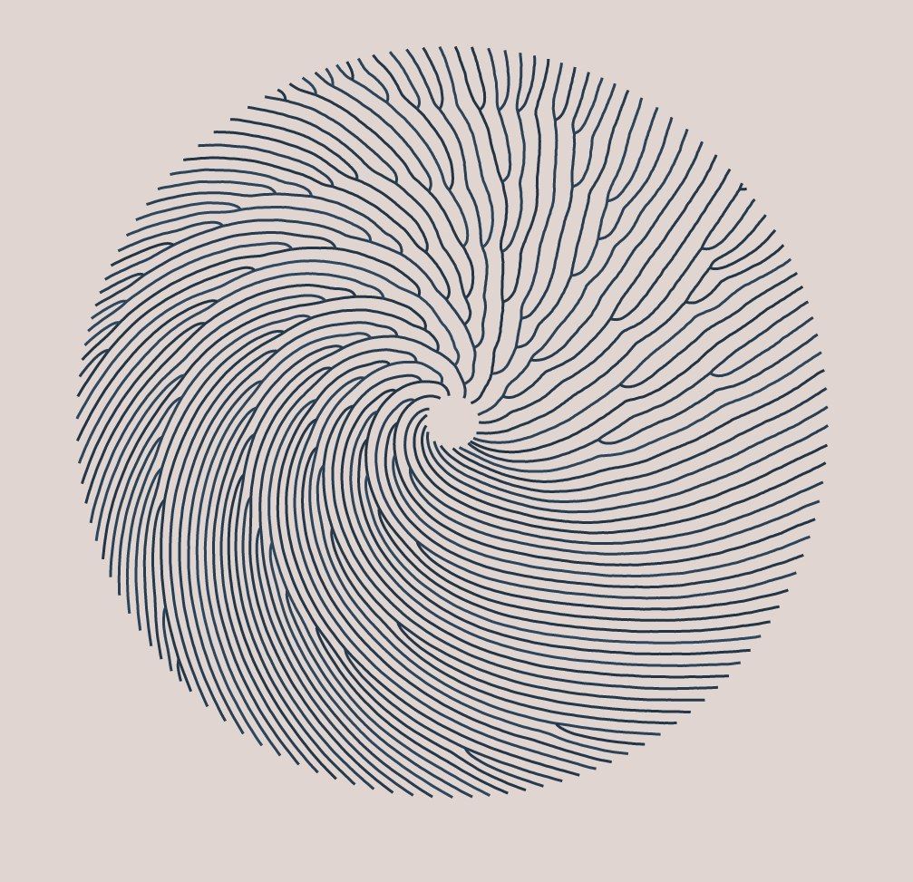

This algorithm starts with a handful of points in a small circle.  The points repel each other but are constrained to stay on the circle, so they end up spacing themselves out evenly.  The circle slowly grows.  When a point has enough space between itself and its neighbors, it divides into two points.

---

[sand-dollar.svg](results/sand-dollar.svg)

---

In this version the physics forces were too strong and the points oscillated whenever a new one was introduced, until they settled down.

[earthquake.svg](results/earthquake.svg)

---

This time I added a twist force and a gravity force to the points.

[wave.svg](results/wave.svg)

--- 

## Install

* Clone this git repo
* Have [node installed](https://nodejs.org/en/).  You can test this by running `node --version` in a shell.  You probably need version 8 or higher.
* Install the dependencies: `npm install`

## Run and edit

* Launch the live development server: `npm run dev`
* Open the page in your browser: http://localhost:8005/

Now you can edit the code.
As you make changes, the browser will auto-refresh and run the algorithm again.
The algorithm settings are all in `src/app.tsx` including settings for the above three images.

## Export images

Take screenshots to get images.

To export an SVG file, use the browser to save the webpage to an HTML file.
Then you have to open that file in a text editor and remove everything except the SVG tag, and rename it from HTML to SVG.
Look at one of the existing SVG files for guidance about the end result.
